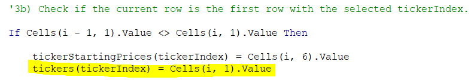

# VBA Challenge

## Overview of Project
### Purpose
This project is to refactor a code previously created to analyze 12 different stocks from 2017 – 2018. The previous code was successful in analyzing the 12 different stocks but was inefficient because the code looped through every row data multiple times. The code was requested by Steve to support his parents’ green energy investment decisions. However, Steve would like to be able to use a code that could efficiently analyze thousands of stocks. We are refactoring the code to loop through every row of data only one time. 

## Results
### Using images and examples of your code, compare the stock performance between 2017 and 2018, as well as the execution times of the original script and the refactored script.
In 2017, aside from VSLR, the year beginning to year end returns were positive. However, in 2018, most of the stocks returns were negative. Using the return value as a performance measurement, the stocks performed better in 2017. Our formatting code made allowed us to come to this conclusion quickly visually because the positive return cells are colored green and the negative return cells are colored red.

In contrast, when using the Total Daily Volume as a performance measure, we conclude that the stocks performed better in 2018. To illustrate, 5 of the 12 stocks had higher volumes in 2017 and 7 of the 12 stocks had higher volumes in 2018.

The original script (yearValueAnalysis) execution times for 2017 and 2018 are both 0.6015625 seconds. The format macro (formatyearValueAnalysis) ran separately from the original script so if the format code was included in the original script, we would expect the execution time to be even longer. The refactored script execution times for both years are 0.078125 as shown in the images below. The lower numbers illustrate that the refactored script is more efficient than the original script. 

## Summary
### What are the advantages or disadvantages of refactoring code?
An advantage of refactoring code means one does not need to completely start from scratch and can use a code that was already successful for another use. When refactoring, there might only need to be a few changes made in the code which would take much less time than writing the entire code. Refactoring also offers the opportunity to make the code more efficient if the current code takes more steps than necessary. A more efficient code improves script running time and the readability of the code. On the other hand, there are also some disadvantages of refactoring code. One disadvantage is that the person refactoring might not have been the original coder which could mean the refactoring coder might have a difficult time reading the code. Another disadvantage is that if a variable is changing in the refactoring, the refactoring coder has to remember to update all the code that references this variable – if any are missed, the code might not work and finding the missing part might take a while.

### How do these pros and cons apply to refactoring the original VBA script?
The pros listed previously definitely applied to this refactoring project. For instance, refactoring the code took less time than starting over - four variables were added and the code was rewritten in a way that looped through all the rows of data only once rather than 12 times in the original code. As demonstrated by the improved execution time, the script is more efficient. The refactored script execution time is about a tenth of the original script execution time. 

The cons listed previously didn’t apply in this case. A con that’s specific to this refactoring project is that the refactored code still requires the coder to manually determine how many stocks are in the data. Steve mentioned that the original code would not work for thousands of stocks. In order for the code to be used for thousands of stocks, any manual calculations to insert into the code would have to be removed. For example, a future refactoring should include a variable to count the unique values from A:2 to the last row of the 2017 or 2018 data sheets. Then, the unique values variable can be inserted in the parenthesis when declaring the various arrays: tickers, tickerVolumes, tickerStartingPrices, and tickerEndingPrices. The unique values variable would also be used when creating the for loop to initialize the tickerVolumes to zero. To avoid manually naming all the indexes for the ticker strings, we would add the below code to the If Loop that determines if the current row is the first row for a ticker. 

